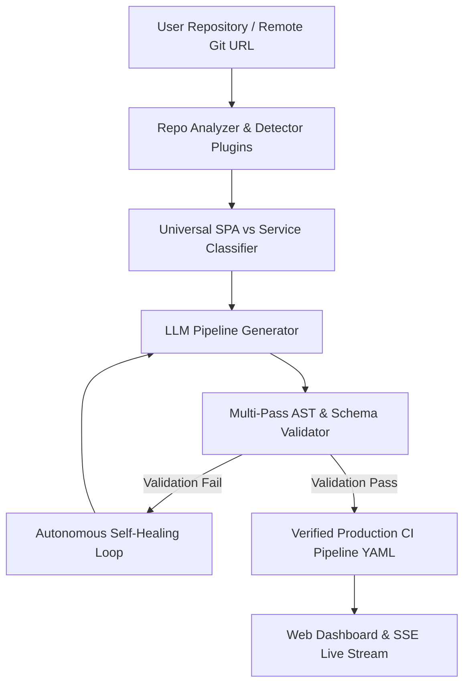

# RepoFlow ⚡


**Zero-Config, Self-Healing CI/CD Pipeline Generator for Any Stack.**

RepoFlow analyzes any repository, detects frameworks and lockfiles, and generates production-ready, validated CI workflows in seconds with real-time SSE progress streaming and autonomous AI self-healing.

---

## ⚡ Product Features

- **🔍 Autonomous Stack & Framework Detection**
  Scans local repos or remote Git URLs across **11+ language ecosystems** (Python, Node.js, .NET, Go, Rust, Java, C/C++, PHP, Ruby, Kotlin, Swift).

- **🌐 Universal SPA vs Service Containerization**
  Intelligently classifies static web SPAs (`nginx:alpine` -> `/usr/share/nginx/html`) vs backend runtime microservices (`node:20-slim`, `aspnet`, `python:3.12-slim`).

- **🩺 Self-Healing Pipeline Engine**
  Multi-pass AST and schema validator that autonomously catches broken syntax, missing steps, or anti-patterns, repairing YAML configurations via LLM feedback loops.

- **⚡ Real-Time SSE Visualizer**
  Streams live pipeline analysis, step execution, logs, and state transitions directly to a modern glassmorphic web dashboard via Server-Sent Events (SSE).

- **🔌 Plug & Play Extensibility**
  Add support for new programming languages or CI platforms in minutes without modifying core engine logic.

---

## 🧩 1-Minute Plug & Play Extensibility

### Add a New Language Plugin (e.g. PHP)
Create `app/core/detectors/php_detector.py` inheriting `BaseDetector`:

```python
class PhpDetector(BaseDetector):
    @property
    def language(self) -> str:
        return "php"

    @property
    def platform_setups(self) -> dict[Platform, PlatformSetupInfo]:
        return {
            Platform.GITHUB_ACTIONS: PlatformSetupInfo("shivammathur/setup-php@v2", "php-version"),
            Platform.AZURE_PIPELINES: PlatformSetupInfo("UsePhpVersion@0", "versionSpec"),
        }

    @property
    def dependency_markers(self) -> dict[str, DependencyInfo]:
        return {
            "composer.json": DependencyInfo(
                manager="composer", language="php",
                install_command="composer install",
                runner_image="php:8.3-fpm-alpine",
                app_type="runtime_service",
            ),
        }
```
*RepoFlow automatically registers the plugin, verifies lockfiles on disk, and renders templates without touching central core files.*

### Add a New CI/CD Platform (e.g. GitLab CI)
1. **Platform Enum**: Add `GITLAB_CI = "gitlab_ci"` to `Platform` in `app/core/platform_detect.py`.
2. **Prompt Template**: Add Jinja2 template `app/prompts/gitlab_ci.j2`.
3. **Validation Schema**: Add JSON Schema `app/schemas/gitlab_ci.schema.json`.
4. **UI Option**: Add `<option value="gitlab_ci">` to `app/templates/index.html`.

---

## 🏗️ System Architecture



---

## 🚀 Quick Start

### Option 1 — Local Setup

```bash
# 1. Clone & setup virtual environment
git clone https://github.com/Soo-de/RepoFlow.git
cd RepoFlow
python3 -m venv .venv && source .venv/bin/activate
pip install -e .

# 2. Configure API key
cp .env.example .env
# Set GEMINI_API_KEY=your_key in .env

# 3. Start development server
uvicorn app.main:app --reload --port 8000
```
Navigate to `http://localhost:8000`.

### Option 2 — Docker Compose

```bash
docker-compose up -d --build
```

---

## 📂 Project Structure

```text
RepoFlow/
├── app/
│   ├── core/           # Analysis engine, AST validation, LLM client & pipeline logic
│   │   └── detectors/  # 11 Ecosystem plugins (Python, Node, C#, Go, Rust, Java, etc.)
│   ├── jobs/           # In-memory store & background job manager
│   ├── models/         # Pydantic API request & response schemas
│   ├── prompts/        # Jinja2 prompt templates (github_actions.j2, azure_pipelines.j2)
│   ├── routes/         # FastAPI REST endpoints & SSE event streams
│   ├── schemas/        # Platform JSON validation schemas
│   ├── static/         # Glassmorphic UI stylesheet & static assets
│   ├── templates/      # Web UI HTML templates
│   └── main.py         # Application entry point
├── tests/              # Pytest unit and integration test suite
├── docker-compose.yml  # Multi-container local deployment
└── pyproject.toml      # Dependency definitions & build config
```

---

## 🧪 Testing

```bash
pytest
```

