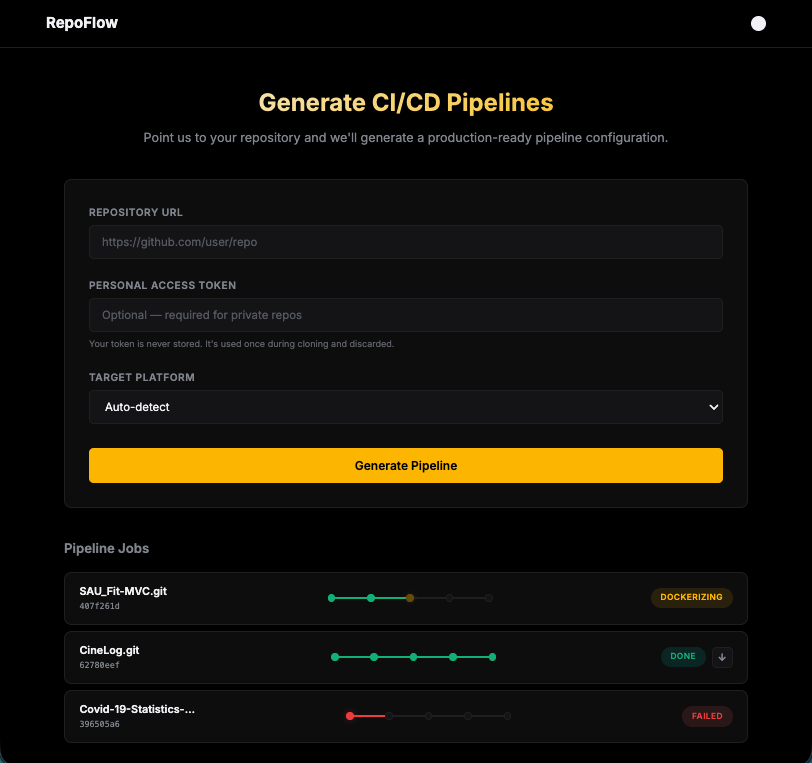
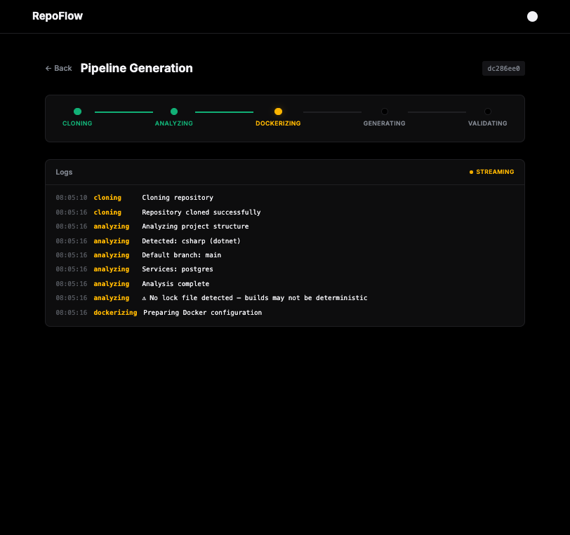
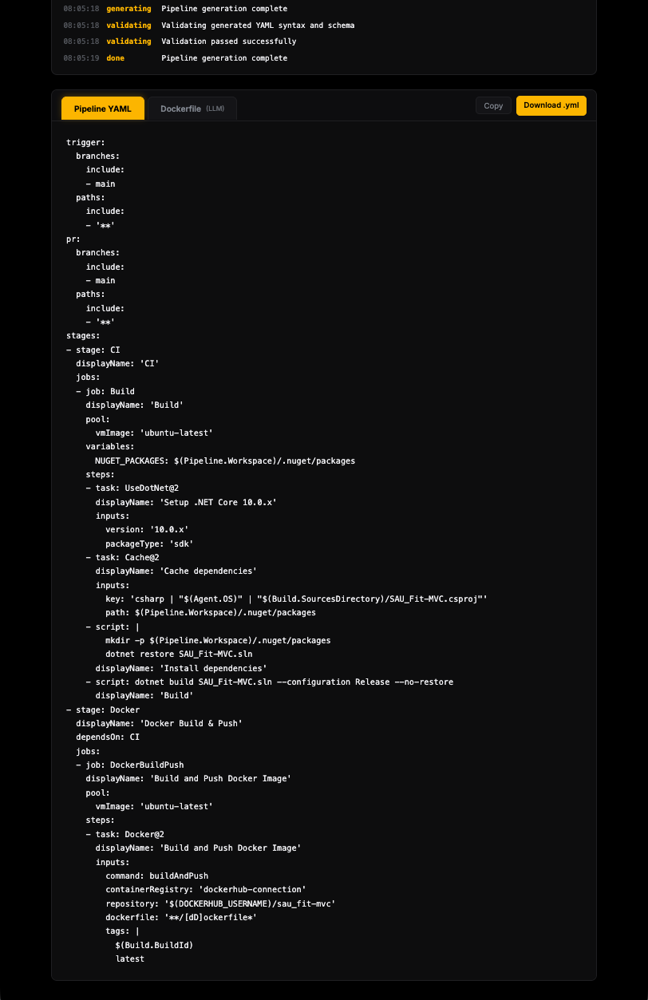
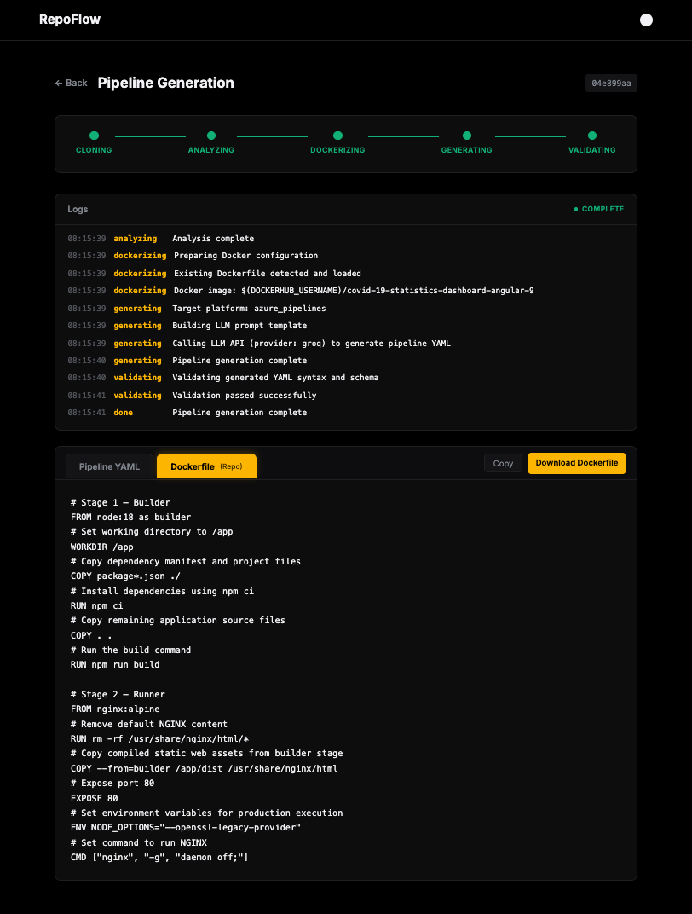
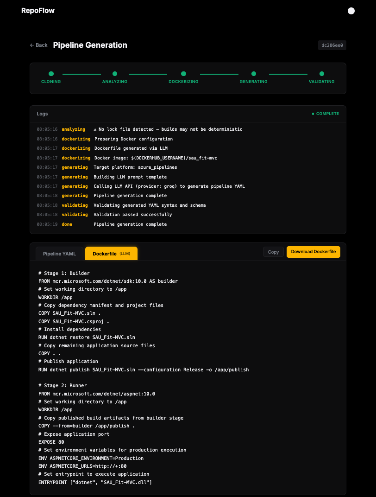
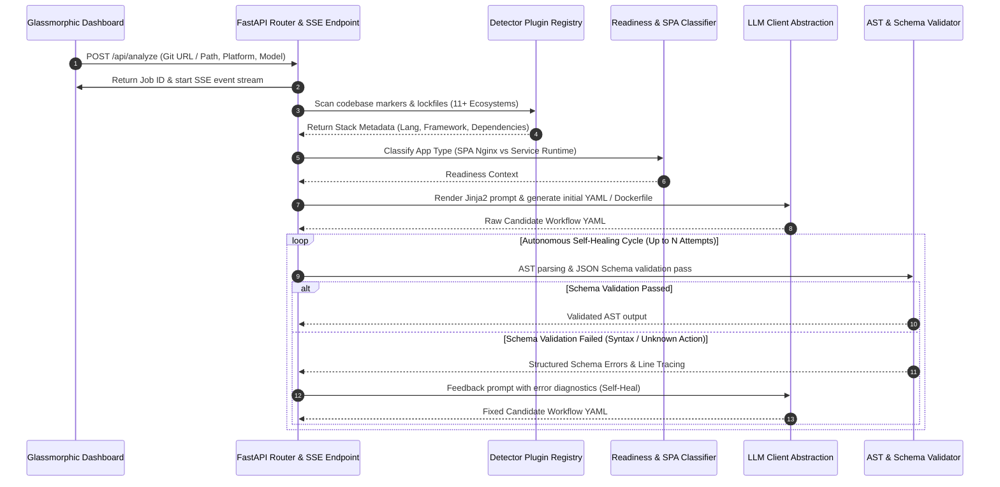

# RepoFlow ⚡


**Autonomous, Self-Healing CI/CD Pipeline & Containerization Generator.**

RepoFlow scans any codebase (local or remote Git URL), automatically discovers project stacks, dependencies, and lockfiles across 11+ language ecosystems — with **active development and testing focused on .NET, Angular/Node.js (JS/TS), and Python** — and generates schema-validated CI/CD pipelines and Dockerfiles. Powered by real-time Server-Sent Events (SSE) progress streaming and a multi-pass autonomous AI self-healing loop.

---

## 📸 Visual Showcase & Interface Tour

Below is the user interface walkthrough demonstrating repository scanning, live streaming analysis, generated pipeline workflows, and Dockerfile comparisons.

### 1. Main Screen & Repository Configuration
*Configure target repository URL or local path, choose target CI platform (GitHub Actions / Azure Pipelines), and select AI model settings.*



---

### 2. Live SSE Analysis & Detailed Event Logs
*Watch real-time stack detection, dependency extraction, template resolution, schema validation passes, and self-healing loop operations.*



---

### 3. Generated CI/CD Pipeline (YAML)
*Inspect fully populated, syntactically verified, production-ready CI pipeline YAML configurations complete with build, test, and artifact steps.*



---

### 4. Containerization View — Repository Dockerfile vs LLM Version

<div align="center">

| Repository-Detected Dockerfile | LLM-Generated Production Dockerfile |
| :---: | :---: |
|  |  |
| *Original Dockerfile detected within the source repository* | *Optimized multi-stage container build generated by LLM* |

</div>

---

## 🏗️ System Architecture & Workflow Pipeline

RepoFlow enforces strict separation of concerns, decoupling repository detection, template rendering, LLM synthesis, schema validation, and real-time frontend streaming.



---

## 🐳 Containerization & Docker Registry Push Workflow

RepoFlow generates optimized multi-stage Dockerfiles and container build & push jobs in generated CI/CD pipelines (GitHub Actions & Azure Pipelines).

### 🔑 Platform Requirements & Authentication Secrets

To allow generated pipelines to build and push images to **Docker Hub**, the target CI/CD platform must be pre-configured with required credentials and connections:

#### 1. GitHub Actions (Secrets Setup)
In your GitHub repository under **Settings → Secrets and variables → Actions**, add:
- **`DOCKERHUB_USERNAME`**: Your Docker Hub username.
- **`DOCKERHUB_PASSWORD`** (or **`DOCKERHUB_TOKEN`**): Your Docker Hub password or Personal Access Token (PAT).

*The generated `.github/workflows/ci.yml` uses `docker/login-action@v3` with `${{ secrets.DOCKERHUB_USERNAME }}` and `${{ secrets.DOCKERHUB_PASSWORD }}`.*

#### 2. Azure Pipelines (Service Connection & Variables Setup)
Azure Pipelines uses service connections for registry authentication:
- **Service Connection**: Create a Docker Registry Service Connection named **`dockerhub-connection`** under **Project Settings → Service Connections**.
- **Pipeline Variable**: Define **`DOCKERHUB_USERNAME`** in Pipeline Variables or Library Variable Group (used to format the repository namespace `$(DOCKERHUB_USERNAME)/<image-name>`).

*The generated `azure-pipelines.yml` uses `task: Docker@2` with `containerRegistry: 'dockerhub-connection'`.*

---

## 🧩 Architectural Wellness & Modular Extensibility

RepoFlow is designed for high maintainability and zero-coupling extension. Adding new language support, new CI/CD target platforms, or alternative LLM providers requires zero modifications to central orchestration logic.

### 1. Adding a New Language Plugin (e.g. PHP)
Create a detector class inheriting from `BaseDetector` inside `app/core/detectors/php_detector.py`:

```python
from app.core.detectors.base import BaseDetector, DependencyInfo, PlatformSetupInfo
from app.core.platform_detect import Platform

class PhpDetector(BaseDetector):
    @property
    def language(self) -> str:
        return "php"

    @property
    def platform_setups(self) -> dict[Platform, PlatformSetupInfo]:
        return {
            Platform.GITHUB_ACTIONS: PlatformSetupInfo("shivammathur/setup-php@v2", "php-version"),
            Platform.AZURE_PIPELINES: PlatformSetupInfo("UsePhpVersion@0", "versionSpec"),
        }

    @property
    def dependency_markers(self) -> dict[str, DependencyInfo]:
        return {
            "composer.json": DependencyInfo(
                manager="composer",
                language="php",
                install_command="composer install",
                runner_image="php:8.3-fpm-alpine",
                app_type="runtime_service",
            ),
        }
```
*RepoFlow's `DetectorRegistry` automatically registers the plugin on application startup, enabling instant stack detection and lockfile verification.*

---

### 2. Adding a New CI/CD Platform (e.g. GitLab CI)
To introduce a new CI/CD workflow provider, follow this 4-step isolated pattern:

1. **Enum Register**: Add `GITLAB_CI = "gitlab_ci"` in `app/core/platform_detect.py`.
2. **Prompt Template**: Add Jinja2 template `app/prompts/gitlab_ci.j2`.
3. **Validation Schema**: Add JSON schema definition `app/schemas/gitlab_ci.schema.json`.
4. **UI Front-End**: Add platform option entry `<option value="gitlab_ci">` in `app/templates/index.html`.

---

### 3. LLM Provider Architecture & Extensibility (.env Configured)

RepoFlow features an asynchronous multi-provider LLM client (`app/core/llm_client.py`) with automatic rate-limit fallback (Gemini → Groq → OpenAI) powered by Pydantic settings (`app/settings.py`).

#### ⚙️ Environment Configuration (`.env`)
Environment variables in `.env` dictate which providers and keys are available:

```bash
# Provider strategy: "auto" (default fallback), "gemini", "groq", or "openai"
LLM_PROVIDER=auto

# Provider API Keys
GEMINI_API_KEY=your_gemini_api_key
GROQ_API_KEY=your_groq_api_key
OPENAI_API_KEY=your_openai_api_key

# Optional Model Overrides
GEMINI_MODEL=gemini-2.0-flash
GROQ_MODEL=llama-3.3-70b-versatile
OPENAI_MODEL=gpt-4o-mini
```

*In `auto` mode, RepoFlow seamlessly uses Gemini as primary, automatically falling back to Groq or OpenAI if rate limits (429) or missing keys are encountered.*

#### ➕ Adding a New LLM Provider (e.g. Anthropic / Ollama)
To add a new provider (e.g., Anthropic Claude or local Ollama), follow these 3 steps:

1. **Update Environment Settings (`app/settings.py` & `.env`)**:
   Add new fields to `Settings` in `app/settings.py`:
   ```python
   anthropic_api_key: str = ""
   anthropic_model: str = "claude-3-5-sonnet-20241022"
   ```
2. **Add Generation Handler (`app/core/llm_client.py`)**:
   Implement `_generate_anthropic(self, prompt: str)` in `LLMClient`:
   ```python
   async def _generate_anthropic(self, prompt: str) -> str:
       # HTTP call to Anthropic API endpoint
       ...
   ```
3. **Connect to Router**: Add `"anthropic"` option to `LLMClient.generate()` and append it to the `auto` fallback chain.

## ⚡ Supported Language Ecosystems

RepoFlow includes modular detector plugins for **11+ language ecosystems**. Project scanning and pipeline generation are currently **in active testing and development** primarily on **.NET, Angular/Node.js (JS/TS), and Python** projects. 

> [!NOTE]
> **Monorepo Support**: RepoFlow detects monorepo directory structures containing multiple lockfiles across sub-folders. Pipeline generation currently focuses on targeted workflow creation for the identified primary language stack/project rather than multi-language hybrid matrix pipelines within a single workflow.

| Language / Stack | Development Status | Dependency Lockfiles / Markers | Target Runner Images | Frameworks & App Types |
| :--- | :--- | :--- | :--- | :--- |
| **.NET / C#** | `🟡 Primary Focus (Active Testing)` | `.csproj`, `.sln` | `mcr.microsoft.com/dotnet/sdk` | ASP.NET Core, WebAPI, xUnit |
| **Node.js / JS / TS** | `🟡 Primary Focus (Active Testing)` | `package.json`, `package-lock.json`, `yarn.lock`, `pnpm-lock.yaml` | `node:20-slim`, `nginx:alpine` | Angular (node builders), React, Vue, Express, Next.js |
| **Python** | `🟡 Primary Focus (Active Testing)` | `requirements.txt`, `Pipfile`, `pyproject.toml`, `poetry.lock` | `python:3.12-slim` | FastAPI, Django, Flask, Pytest |
| **Go** | `⚙️ Experimental Detector` | `go.mod` | `golang:1.22-alpine` | Gin, Fiber, Go Test |
| **Rust** | `⚙️ Experimental Detector` | `Cargo.toml` | `rust:1.77-slim` | Actix, Axum, Cargo Test |
| **Java** | `⚙️ Experimental Detector` | `pom.xml`, `build.gradle` | `eclipse-temurin:21-jdk` | Spring Boot, Maven, Gradle |
| **C / C++** | `⚙️ Experimental Detector` | `CMakeLists.txt`, `Makefile` | `gcc:latest`, `alpine:latest` | CMake, Make, CTest |
| **PHP** | `⚙️ Experimental Detector` | `composer.json` | `php:8.3-fpm-alpine` | Laravel, Symfony |
| **Ruby** | `⚙️ Experimental Detector` | `Gemfile` | `ruby:3.3-slim` | Rails, RSpec |
| **Kotlin** | `⚙️ Experimental Detector` | `build.gradle.kts` | `eclipse-temurin:21-jdk` | Ktor, Gradle |
| **Swift** | `⚙️ Experimental Detector` | `Package.swift` | `swift:5.9` | Swift Package Manager |

---

## 🚀 Quick Start

### Local Installation

```bash
# 1. Clone repository & initialize environment
git clone https://github.com/Soo-de/RepoFlow.git
cd RepoFlow
python3 -m venv .venv && source .venv/bin/activate

# 2. Install dependencies in editable mode
pip install -e .

# 3. Configure environment variables
cp .env.example .env
# Add your API Key in .env (e.g. GEMINI_API_KEY=your_key)

# 4. Launch FastAPI Server
uvicorn app.main:app --reload --port 8000
```
Open `http://localhost:8000` in your browser.

---

### Docker Deployment

```bash
docker-compose up -d --build
```

---

## 📂 Codebase Directory Architecture

```text
RepoFlow/
├── app/
│   ├── core/           # Core engine, AST validators, LLM interfaces & readiness classifiers
│   │   └── detectors/  # 11+ Modular ecosystem plugins (Python, Node, C#, Go, Rust, etc.)
│   ├── jobs/           # Asynchronous in-memory job store & streaming background runner
│   ├── models/         # Pydantic request/response model specifications
│   ├── prompts/        # Jinja2 prompt templates (github_actions.j2, azure_pipelines.j2)
│   ├── routes/         # FastAPI REST API controllers & Server-Sent Events (SSE) endpoints
│   ├── schemas/        # JSON Validation schemas for CI platform YAML validation
│   ├── static/         # Modern glassmorphic CSS stylesheet & web assets
│   ├── templates/      # Dashboard HTML web interface
│   └── main.py         # Application bootstrap & FastAPI initialization
├── docs/
│   └── screenshots/    # UI screenshots & showcase assets
├── tests/              # Unit & integration pytest test suite
├── docker-compose.yml  # Multi-container orchestration config
└── pyproject.toml      # Project manifest & dependency configuration
```

---

## 🧪 Running Tests

```bash
pytest
```
