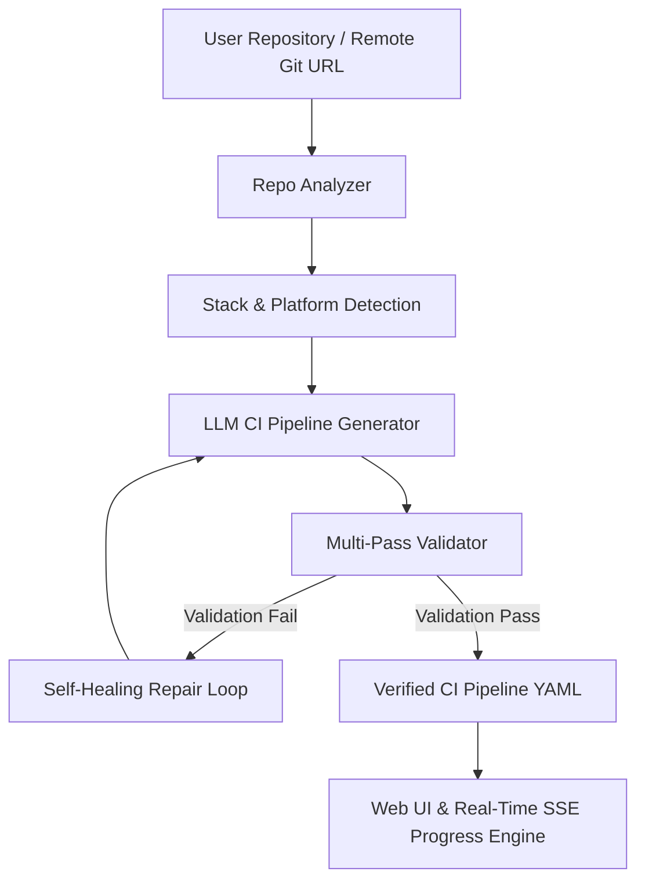

# RepoFlow 🚀


**RepoFlow** is an AI-powered Continuous Integration (CI) pipeline generator and self-healing engine built on a **modular, platform-agnostic architecture**. It analyzes software repositories, automatically detects tech stacks and project configurations, and generates optimized, production-ready CI workflows with real-time tracking and automated error recovery.

> **Note:** RepoFlow specifically focuses on **CI (Continuous Integration)** generation—including automated testing, linting, dependency caching, build verification, and container packaging—rather than full deployment (CD) orchestrations.

---

## ✨ Key Features

- **🔍 Automatic Repository Analysis**
  Scans local paths or remote Git URLs to detect programming languages, frameworks, package managers, test suites, and Docker configurations.

- **🤖 AI-Driven CI Generation**
  Generates clean, standardized CI workflows tailored to your project using Google Gemini or Groq LLMs with Jinja2 prompt engineering.

- **🩺 Self-Healing Pipeline Engine**
  Validates generated YAML files against platform schemas, syntax rules, and anti-patterns. Automatically repairs broken configurations using LLM feedback loops.

- **⚡ Real-Time Streaming & Visualizer**
  Streams live job progress, step updates, logs, and state transitions to an interactive web interface via Server-Sent Events (SSE).

- **🌐 Modular Platform Architecture**
  Designed with an extensible platform-based implementation layer. Currently supports **GitHub Actions** (`.github/workflows/ci.yml`) and **Azure Pipelines** (`azure-pipelines.yml`) out of the box, with a pluggable design for adding future platforms.

---

## ⚙️ Key Technologies

- **AI & Prompt Engineering:** Google Gemini API (`gemini-2.0-flash`), Groq API (`llama-3.3-70b-versatile`), Jinja2 Template Engine
- **Backend & Async Runtime:** Python 3.11+, FastAPI, Uvicorn, Pydantic Settings
- **Real-Time Streaming:** `sse-starlette` (Server-Sent Events)
- **Validation & AST Parsing:** PyYAML, JSONSchema, custom platform-specific validation rules
- **Frontend & UI:** Modern Vanilla CSS (Dark mode & Glassmorphic aesthetics), HTML5, Jinja2 Templates

---

## 🏗️ Architecture & Workflow



---

## 🚀 Quick Start

### 1. Prerequisites
- **Python 3.11+**
- **Git**
- An API Key for **Google Gemini** or **Groq**

### 2. Installation

Clone the repository and set up a virtual environment:

```bash
git clone https://github.com/Soo-de/RepoFlow.git
cd RepoFlow

python3 -m venv .venv
source .venv/bin/activate
pip install -e .
```

### 3. Environment Configuration

Create a `.env` file from `.env.example`:

```bash
cp .env.example .env
```

Add your API credentials to `.env`:

```env
LLM_PROVIDER=auto
GEMINI_API_KEY=your_gemini_api_key_here
# GROQ_API_KEY=your_groq_api_key_here
```

### 4. Run the Application

Start the FastAPI development server:

```bash
uvicorn app.main:app --reload --port 8000
```

Open your browser and navigate to `http://localhost:8000`.

---

## 📂 Project Structure

```text
RepoFlow/
├── app/
│   ├── core/           # Repository analysis, LLM client, self-healing & validation
│   ├── jobs/           # In-memory job store & background job manager
│   ├── models/         # Pydantic schemas and request models
│   ├── prompts/        # Jinja2 prompt templates for target platforms
│   ├── routes/         # FastAPI endpoints (generate, jobs, health)
│   ├── static/         # CSS styles and frontend assets
│   ├── templates/      # Jinja2 HTML templates for Web UI
│   └── main.py         # Application entry point
├── tests/              # Pytest unit and integration test suite
├── pyproject.toml      # Project dependencies & build configuration
└── .env.example        # Environment variable template
```

---

## 🧪 Running Tests

Run the test suite using `pytest`:

```bash
pytest
```

