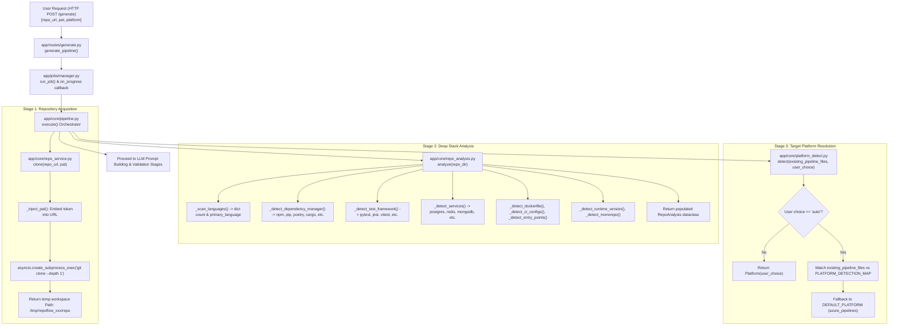

# 🔍 Track Plan Group 1: Repository Scanning & Stack Analysis

## 📌 Executive Overview

The **Repository Scanning & Stack Analysis** subsystem is the initial operational phase of **RepoFlow**. It is responsible for:
1. Securely cloning remote Git repositories (supporting public & private repos via Personal Access Tokens).
2. Deep static structure & pattern analysis (languages, package managers, test runners, entry points, container setups, and external services).
3. CI/CD platform target auto-resolution (GitHub Actions vs. Azure Pipelines).
4. End-to-end stage orchestration, progress reporting, and workspace lifecycle cleanup.

---

## 📁 Architectural & File Map

| File Path | Lines | Core Responsibility | Primary Links & Dependencies |
| :--- | :---: | :--- | :--- |
| [app/core/repo_service.py](file:///Users/Sude/Documents/GitHub/RepoFlow/app/core/repo_service.py) | 110 | Git cloning, credential injection, URL sanitization, timeout management | `asyncio`, `tempfile`, `urllib.parse`, `subprocess` |
| [app/core/repo_analysis.py](file:///Users/Sude/Documents/GitHub/RepoFlow/app/core/repo_analysis.py) | 413 | Directory walking, file extension counter, pattern matcher for stack detection | `pathlib.Path`, `dataclasses` |
| [app/core/platform_detect.py](file:///Users/Sude/Documents/GitHub/RepoFlow/app/core/platform_detect.py) | 43 | CI target platform enum & priority resolution logic | `enum.Enum`, `logging` |
| [app/core/pipeline.py](file:///Users/Sude/Documents/GitHub/RepoFlow/app/core/pipeline.py) | 126 | Orchestrator tying cloning $\rightarrow$ scanning $\rightarrow$ LLM generation $\rightarrow$ validation | `repo_service`, `repo_analysis`, `platform_detect`, `LLMClient`, `PipelineValidator` |

---

## 🗺️ Physical & Logical Data Workflow Diagram



---

## 🔎 Detailed File & Function Breakdown

### 1. [repo_service.py](file:///Users/Sude/Documents/GitHub/RepoFlow/app/core/repo_service.py)

Handles workspace creation, remote Git cloning over HTTP/HTTPS, secret protection, and error message sanitization.

#### Functions & Data Lineage

##### `_inject_pat(url: str, pat: str) -> str`
- **Parameters**:
  - `url` (`str`): Base repository URL (e.g., `https://github.com/org/repo.git`). Passed from `clone()`.
  - `pat` (`str`): Personal Access Token or App Password. Passed from `clone()`.
- **Parameter Lineage & Origin**: User input in web UI form field `pat` $\rightarrow$ FastAPI endpoint [app/routes/generate.py](file:///Users/Sude/Documents/GitHub/RepoFlow/app/routes/generate.py#L31) $\rightarrow$ `manager.run_job` in [app/jobs/manager.py](file:///Users/Sude/Documents/GitHub/RepoFlow/app/jobs/manager.py#L11) $\rightarrow$ `pipeline.execute` in [app/core/pipeline.py](file:///Users/Sude/Documents/GitHub/RepoFlow/app/core/pipeline.py#L20) $\rightarrow$ `clone` in [app/core/repo_service.py](file:///Users/Sude/Documents/GitHub/RepoFlow/app/core/repo_service.py#L67) $\rightarrow$ `_inject_pat`.
- **Fulfillment**: Uses Python's `urllib.parse.urlparse` and `urlunparse` to modify `netloc` into `{pat}@{hostname}` (and port if non-standard).
- **Linkage**: Returns sanitized authenticated URL to `clone()` for process execution.

##### `_parse_clone_error(stderr: str) -> str`
- **Parameters**:
  - `stderr` (`str`): Standard error output captured from failed `git clone` process execution.
- **Parameter Lineage & Origin**: Captured by `asyncio.subprocess.PIPE` inside `clone()` when `process.returncode != 0`.
- **Fulfillment**: Scans stderr lowercase content for keywords like `"authentication failed"`, `"repository not found"`, `"could not resolve host"`. Uses regex `https://[^@]+@` to scrub token signatures from error output to prevent credential leaking.
- **Linkage**: Returns user-safe error message string wrapped inside `CloneError`.

##### `async clone(repo_url: str, pat: str = "") -> Path`
- **Parameters**:
  - `repo_url` (`str`): Git clone target URL.
  - `pat` (`str`, default `""`): Optional authentication token.
- **Parameter Lineage & Origin**: Directly passed from `pipeline.execute()`.
- **Fulfillment**:
  1. Calls `_inject_pat(repo_url, pat)` if `pat` is non-empty.
  2. Creates temporary directory `tempfile.mkdtemp(prefix="repoflow_")`.
  3. Sets process environment overrides `GIT_TERMINAL_PROMPT="0"` and `GIT_ASKPASS=""` to disallow interactive authentication hangs.
  4. Spawns `git -c credential.helper= clone --depth 1 <clone_url> <repo_dir>`.
  5. Enforces `CLONE_TIMEOUT_SECONDS = 120` via `asyncio.wait_for()`.
- **Linkage**: Returns `repo_dir` (`Path` object) to `pipeline.execute()`. Raises `CloneError` on timeout or non-zero exit code.

---

### 2. [repo_analysis.py](file:///Users/Sude/Documents/GitHub/RepoFlow/app/core/repo_analysis.py)

Primary static analysis module. Scans project directory structure, dependencies, configuration files, and source extensions to produce a `RepoAnalysis` data structure.

#### Data Structures

##### `@dataclass RepoAnalysis`
- Fields:
  - `primary_language: str`: Main detected programming language (default `"unknown"`).
  - `languages: dict[str, int]`: File counts per language.
  - `runtime_version: str | None`: Language runtime version (e.g. `"3.11"`, `"18"`).
  - `dependency_manager: str`: Manager name (e.g., `"pip"`, `"poetry"`, `"npm"`, `"cargo"`).
  - `install_command: str`: Shell command to install dependencies.
  - `build_command: str | None`: Command to build artifacts (e.g., `"npm run build"`).
  - `publish_dir: str | None`: Resolved pre-compiled build output directory (e.g., `"dist"`, `"publish"`, `"target"`) used for targeted artifact publishing.
  - `test_framework: str | None`: Identified testing suite (e.g., `"pytest"`, `"jest"`).
  - `test_command: str | None`: Shell command to execute tests.
  - `has_dockerfile: bool`: Indicates if `Dockerfile` is present in root.
  - `services_needed: list[str]`: External infrastructure services needed (e.g., `["postgres", "redis"]`).
  - `monorepo: bool`: Set to `True` if multiple package configs exist in subdirectories.
  - `existing_pipeline_files: list[str]`: Existing CI config file paths found.
  - `entry_points: list[str]`: Discovered main execution files.

#### Key Functions & Data Lineage

##### `analyze(repo_dir: Path) -> RepoAnalysis`
- **Parameters**:
  - `repo_dir` (`Path`): Cloned repository directory path.
- **Parameter Lineage & Origin**: Output of `clone()` returned to `pipeline.execute()`.
- **Fulfillment**: Instantiates `RepoAnalysis()` and sequentially calls 9 private sub-analyzers (`_scan_languages`, `_detect_dependency_manager`, `_detect_test_framework`, `_detect_services`, `_detect_dockerfile`, `_detect_ci_configs`, `_detect_entry_points`, `_detect_runtime_version`, `_detect_monorepo`).
- **Linkage**: Returns fully populated `RepoAnalysis` instance to `pipeline.execute()`.

##### `_scan_languages(repo_dir: Path, result: RepoAnalysis) -> None`
- Walks directory tree with `repo_dir.rglob("*")`, excluding directories in `SKIP_DIRS` (`.git`, `node_modules`, `venv`, etc.).
- Maps file extensions (`.py`, `.ts`, `.go`, `.rs`, etc.) to language names via `LANGUAGE_EXTENSIONS`.
- Populates `result.languages` and sets `result.primary_language` to the extension with highest count.

##### `_detect_dependency_manager(repo_dir: Path, result: RepoAnalysis) -> None`
- Checks root directory first via `_find_dependency_marker()`, then immediate subdirectories.
- Matches markers against `DEPENDENCY_MARKERS` map (e.g., `pyproject.toml`, `package.json`, `Cargo.toml`).
- Populates `result.dependency_manager`, `result.install_command`, `result.build_command`, and fallback `result.primary_language`.

##### `_detect_test_framework(repo_dir: Path, result: RepoAnalysis, registry: DetectorRegistry) -> None`
- Delegates framework resolution to language detectors, prioritizing the primary language.
- Calls `has_test_files()` to verify that actual test source files or test folders exist on disk before assigning a test command.
- If no test files exist in the repository, leaves `result.test_framework` and `result.test_command` as `None`, preventing false-positive test steps and avoiding CI stage generation when no build/test tasks exist.

##### `_detect_services(repo_dir: Path, result: RepoAnalysis) -> None`
- Reads contents of dependency manifest files (`requirements.txt`, `package.json`, `Cargo.toml`, `go.mod`).
- Matches client library names (`psycopg2`, `redis`, `mongodb`, `amqplib`, `celery`) against `SERVICE_HINTS` dictionary.
- Collects and sorts unique required services into `result.services_needed`.

##### `_detect_dockerfile(repo_dir: Path, result: RepoAnalysis) -> None`
- Sets `result.has_dockerfile = (repo_dir / "Dockerfile").exists()`.

##### `_detect_ci_configs(repo_dir: Path, result: RepoAnalysis) -> None`
- Checks paths listed in `CI_CONFIG_PATHS` (`.github/workflows`, `azure-pipelines.yml`, `.gitlab-ci.yml`, etc.).
- Collects relative file paths into `result.existing_pipeline_files`.

##### `_detect_entry_points(repo_dir: Path, result: RepoAnalysis) -> None`
- Searches workspace recursively for standard entry point patterns (`main.py`, `app.py`, `server.ts`, `main.go`, etc.).
- Populates relative paths into `result.entry_points`.

##### `_detect_runtime_version(repo_dir: Path, result: RepoAnalysis) -> None`
- Reads version pinning files (`.python-version`, `.nvmrc`, `rust-toolchain.toml`, `go.mod`, `pyproject.toml`).
- Extracts and assigns version string to `result.runtime_version`.

##### `_detect_monorepo(repo_dir: Path, result: RepoAnalysis) -> None`
- Counts subdirectories containing package manifests. Sets `result.monorepo = True` if $\ge 2$ subpackages exist.

---

### 3. [platform_detect.py](file:///Users/Sude/Documents/GitHub/RepoFlow/app/core/platform_detect.py)

Defines platform target enumeration and resolves which CI platform configuration to generate.

#### Classes & Functions

##### `class Platform(str, Enum)`
- `GITHUB_ACTIONS = "github_actions"`
- `AZURE_PIPELINES = "azure_pipelines"`

##### `detect(existing_pipeline_files: list[str], user_choice: str = "auto") -> Platform`
- **Parameters**:
  - `existing_pipeline_files` (`list[str]`): List of CI config paths found during repo analysis (`analysis.existing_pipeline_files`).
  - `user_choice` (`str`, default `"auto"`): Target platform selected by user or API caller.
- **Parameter Lineage & Origin**: User form input `platform` passed to `pipeline.execute()`.
- **Priority Resolution Logic**:
  1. **User Choice Overrides**: If `user_choice != "auto"`, attempts `Platform(user_choice)`.
  2. **Auto-Detection**: Scans `existing_pipeline_files` against `PLATFORM_DETECTION_MAP`:
     - `.github/workflows` $\rightarrow$ `Platform.GITHUB_ACTIONS`
     - `azure-pipelines.yml` / `.azure-pipelines` $\rightarrow$ `Platform.AZURE_PIPELINES`
  3. **Fallback Default**: Returns `DEFAULT_PLATFORM` (`Platform.AZURE_PIPELINES`).

---

### 4. [pipeline.py](file:///Users/Sude/Documents/GitHub/RepoFlow/app/core/pipeline.py)

High-level orchestrator executing the full end-to-end process flow and emitting progress updates to the caller.

#### Types & Functions

##### `ProgressCallback = Callable[[str, str], None]`
- Type hint for progress notification callbacks taking `(stage, message)`.

##### `async execute(repo_url: str, pat: str, platform: str, on_progress: ProgressCallback | None = None) -> PipelineResult`
- **Parameters**:
  - `repo_url` (`str`): Target repository URL.
  - `pat` (`str`): Personal Access Token.
  - `platform` (`str`): Platform selection (`"auto"`, `"github_actions"`, `"azure_pipelines"`).
  - `on_progress` (`ProgressCallback | None`): Async/sync callback function for UI status updates.
- **Parameter Lineage & Origin**: Instantiated in `app/jobs/manager.py` within `run_job()`. `on_progress` is bound to update `app.jobs.store`.
- **Execution Flow**:
  1. **Stage 1 (Cloning)**: Invokes `clone(repo_url, pat)`. Sets `workspace = repo_dir.parent`.
  2. **Stage 2 (Analyzing)**: Calls `analyze(repo_dir)`. Reports detected primary language, package manager, test framework, services.
  3. **Stage 3 (Generating)**:
     - Resolves platform via `detect_platform(analysis.existing_pipeline_files, platform)`.
     - Builds prompt using `PromptBuilder().build(detected_platform, analysis)`.
     - Calls `LLMClient.generate(prompt)`.
  4. **Stage 4 (Validating & Retrying)**:
     - Validates output using `PipelineValidator().validate(...)`.
     - Retries up to `max_retries = 2` with `PromptBuilder.build_correction(...)` if syntax/schema errors are found.
  5. **Cleanup (`finally`)**:
     - Closes `LLMClient`.
     - Deletes temporary workspace directory via `shutil.rmtree(workspace)` to prevent disk leaks.
- **Return Value**: Returns a populated `PipelineResult` dataclass containing analysis summary, platform, generated YAML, and validation status.

---

## 🔗 Multi-Group Connection & Variable Flow Summary

```
[User Form / API POST /generate]
    │
    ├──> repo_url  ───────┐
    ├──> pat       ───────┼──> app/jobs/manager.py (run_job)
    └──> platform  ───────┤        │
                           │        ▼
                           └──> app/core/pipeline.py (execute)
                                    │
       ┌────────────────────────────┼────────────────────────────┐
       ▼                            ▼                            ▼
app/core/repo_service.py   app/core/repo_analysis.py    app/core/platform_detect.py
(clone repo to /tmp)        (scan Path AST & configs)    (resolve target Platform)
       │                            │                            │
       └──────────────┬─────────────┘                            │
                      ▼                                          │
               RepoAnalysis dataclass ───────────────────────────┤
                      │                                          │
                      ▼                                          ▼
           PromptBuilder.build(detected_platform, analysis)
                      │
                      ▼
           LLMClient.generate(prompt)
                      │
                      ▼
           PipelineValidator.validate(...)
                      │
                      ▼
           PipelineResult returned to Job Store & Web UI
```

---

## 📦 Generated Pipeline Build & Artifact Publishing Architecture

RepoFlow enforces a multi-stage **Build once, reuse everywhere** artifact architecture in all generated CI/CD workflows (Azure Pipelines & GitHub Actions).

### Why This Architecture Was Implemented

1. **Eliminating Redundant Build Overhead (Performance)**:
   - In traditional multi-job CI pipelines, jobs (`Build`, `Test`, `Docker`) run on isolated virtual machines with clean filesystems.
   - Without artifact sharing, each subsequent job is forced to run `dotnet restore` + `dotnet build` (or `npm run build`) from scratch, doubling or tripling pipeline execution time.
   - By running `PublishPipelineArtifact@1` (Azure) or `actions/upload-artifact@v4` (GitHub) at the end of the `Build` job, compiled binaries are packaged into a reusable pipeline artifact (`drop` / `build-output`).

2. **Ensuring Strict Binary Parity**:
   - Downloading pre-compiled build artifacts via `DownloadPipelineArtifact@2` / `actions/download-artifact@v4` in `Test` and `Docker` jobs ensures that tests are run against—and Docker images are built from—the **exact binaries** produced during compilation, eliminating "works on build job but fails on test job" inconsistencies.

3. **Isolated Publishing vs Compilation**:
   - For compiled ecosystems (.NET, Go, Rust, Java), RepoFlow distinguishes between compilation (`build_command`) and artifact packaging (`publish_command` to `publish_dir`).
   - This ensures intermediate obj/bin clutter is discarded while clean, self-contained deployment packages are published and containerized.

